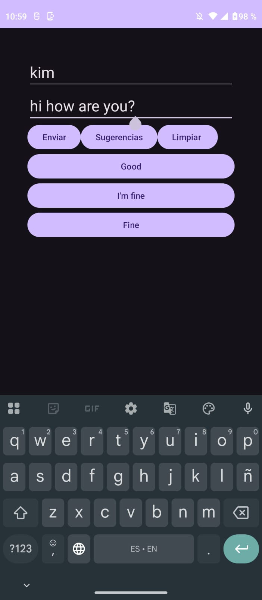
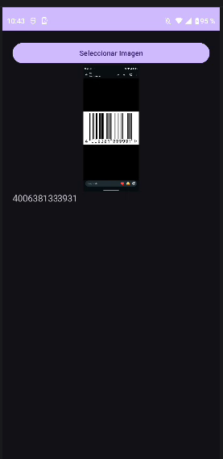

# Laboratorio 11 - BarcodeScanner - ML Kit

Aplicación desarrollada en Android Studio utilizando Kotlin y Google ML Kit.

## Descripción

Este proyecto demuestra el uso de servicios de Machine Learning de Google ML Kit en Android. Se implementó una actividad utilizando Smart Reply y un ejercicio práctico de escaneo de códigos de barras.

---

# Actividad

Implementación de la API **Smart Reply** de Google ML Kit, que genera sugerencias automáticas de respuesta a partir del contexto de una conversación.

## Evidencia

---

# Ejercicio 1

Implementación de un **escáner de códigos de barras y códigos QR** utilizando Google ML Kit.

## Funcionalidades

- Selección de imágenes desde la galería.
- Detección automática de códigos de barras.
- Lectura de códigos QR.
- Visualización de la información detectada.

## Evidencia

---

# Ejercicio 2

## Investigación de servicios de Machine Learning en ML Kit

### Reconocimiento de Texto (Text Recognition)

Permite extraer texto de imágenes mediante OCR (Optical Character Recognition). Este servicio puede utilizarse para digitalizar documentos, leer recibos y extraer información textual de fotografías.

#### Aplicaciones

- Escaneo de documentos.
- Digitalización de apuntes.
- Lectura de recibos.
- Reconocimiento de placas vehiculares.

---

### Detección de Rostros (Face Detection)

Permite identificar rostros humanos en imágenes o video, así como detectar características faciales como sonrisas, apertura de ojos y orientación de la cabeza.

#### Aplicaciones

- Filtros fotográficos.
- Sistemas de asistencia.
- Control de acceso.
- Aplicaciones de seguridad.

---

# Tecnologías Utilizadas

- Kotlin
- Android Studio
- Google ML Kit
- View Binding

---

# Autor

Kimberly Barra Quispe
